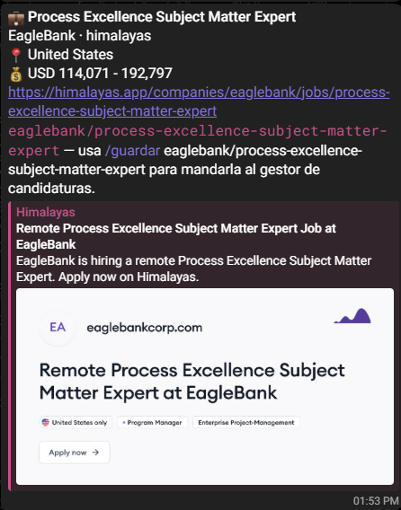
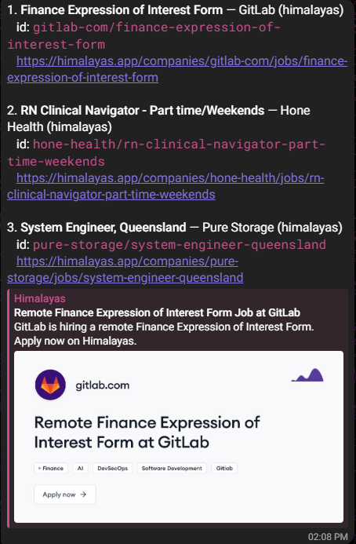
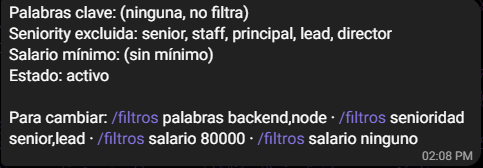
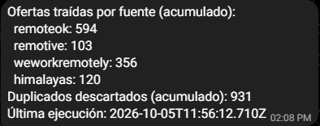
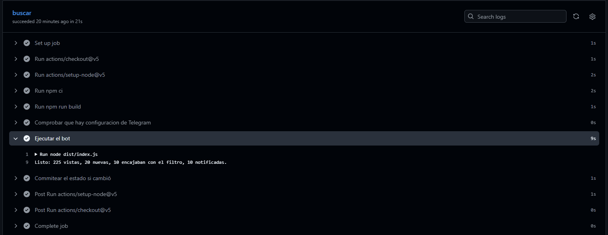

<div align="center">

# Bot de ofertas de empleo

**Revisa cuatro bolsas de empleo remoto sin autenticación, normaliza sus cuatro formatos distintos a uno solo, y avisa por Telegram cuando aparece algo que encaja con tu perfil. Sin servidor: corre entero en GitHub Actions con cron.**

[](https://github.com/danielbuitragoh/bot-ofertas-empleo/actions/workflows/ci.yml)
[](https://github.com/danielbuitragoh/bot-ofertas-empleo/actions/workflows/bot.yml)



[Cómo usarlo](#cómo-usarlo) · [Capturas](#capturas) · [Cliente de gestión que recibe lo que se guarda](https://github.com/danielbuitragoh/gestor-postulaciones)

</div>

---

## Qué es

Un bot de Telegram que cada 6 horas revisa RemoteOK, Remotive, WeWorkRemotely e Himalayas, descarta lo que ya avisó antes, filtra por lo que le hayas dicho que te interesa, y te manda un mensaje por cada oferta nueva que encaje. Todo corre en un workflow programado de GitHub Actions — no hay servidor que mantener despierto, ni base de datos que pagar.

El ejercicio real no es "llamar a una API y mandar un mensaje": es que las cuatro fuentes traen **cuatro formatos distintos** (salario numérico en una, texto libre en otra, fechas ISO en unas y epoch en segundos en otra, RSS en vez de JSON en la cuarta) y hay que normalizarlas todas a un único esquema antes de poder filtrar o deduplicar nada. Eso es el trabajo real de integración que hace un backend developer, y es justo lo que se documenta abajo.

## Capturas

Todas son del bot real corriendo en este repo, no de un mock.

<table>
<tr>
<td width="50%" valign="top"></td>
<td width="50%" valign="top">
  
  <br><br>
  
</td>
</tr>
<tr>
<td><b><code>/ultimas 3</code>.</b> Las últimas ofertas vistas, cada una con un id corto para mandarla al gestor con <code>/guardar</code>. La lista se conserva entre corridas aunque una no traiga nada nuevo.</td>
<td><b><code>/filtros</code> y <code>/stats</code>.</b> Qué está filtrando el bot y cómo cambiarlo, y cuánto ha traído cada una de las cuatro fuentes. Los duplicados descartados son ofertas que ya avisó o que aparecen en dos fuentes a la vez.</td>
</tr>
<tr>
<td colspan="2"></td>
</tr>
<tr>
<td colspan="2"><b><code>/pausar</code> y <code>/reanudar</code>.</b> Silencian y reactivan los avisos sin tocar el workflow: con el bot en pausa, cada corrida sigue procesando comandos pero no busca ni manda ofertas.</td>
</tr>
<tr>
<td colspan="2"></td>
</tr>
<tr>
<td colspan="2"><b>Una corrida en GitHub Actions.</b> Compila, comprueba que estén los secrets de Telegram, ejecuta el bot (<code>225 vistas, 20 nuevas, 10 encajaban con el filtro, 10 notificadas</code>) y commitea el estado. No hay servidor: esto es todo el bot.</td>
</tr>
</table>

## Las cuatro fuentes y su trampa

| Fuente | Endpoint | La trampa |
|---|---|---|
| [RemoteOK](https://remoteok.com) | `GET remoteok.com/api` | El primer elemento del array es un aviso legal, no una oferta — se detecta por la ausencia de `id`, no por posición fija |
| [Remotive](https://remotive.com) | `GET remotive.com/api/remote-jobs` | Máximo 4 peticiones/día; más de 2/min bloquea. Los datos llegan con 24h de retraso deliberado |
| [WeWorkRemotely](https://weworkremotely.com) | `GET weworkremotely.com/remote-jobs.rss` | Es RSS, no JSON. La empresa viene incrustada en el título, separada por `:`. Y la descripción de cada oferta es HTML escapado: el feed real suma más de 27.000 entidades (`&lt;`, `&amp;`...), muy por encima del límite de 1.000 que `fast-xml-parser` impone por seguridad, así que solo se resuelven en los campos que se leen |
| [Himalayas](https://himalayas.app) | `GET himalayas.app/jobs/api` | JSON paginado, salario numérico, fechas en **epoch en segundos** (no milisegundos). El `guid` es la URL entera; como id se usa `empresa/puesto` |

Ver `src/fuentes/*.ts` — cada trampa está resuelta y comentada en el archivo de su propia fuente, no en un sitio aparte.

## Las decisiones que documentan el 80% del valor de este proyecto

**El cron es cada 6 horas, no cada 5 minutos.** GitHub Actions permite hasta cada 5 minutos, pero Remotive solo permite 4 peticiones al día y sus datos llegan con 24h de retraso a propósito: ir más rápido no mostraría nada nuevo y arriesgaría que Remotive bloquee las peticiones por exceso. Respetar el límite de un tercero cuando nadie te obliga a mirarlo es una señal de criterio, no un límite técnico que "tocó aceptar".

**La deduplicación es entre fuentes, no solo dentro de cada una.** El mismo puesto puede aparecer en RemoteOK y en Himalayas el mismo día. El id de cada fuente no sirve para detectarlo (cada una tiene su propio espacio de ids), así que se usa una huella de `empresa + título` normalizados (sin acentos, minúsculas, sin puntuación) — ver `src/dedup.ts`.

**El estado entre ejecuciones es un JSON committeado al propio repo, no el API de `api-postulaciones`.** GitHub Actions no recuerda nada entre corridas: cada una arranca un contenedor limpio. Guardar el estado (qué ya se notificó, los filtros, los contadores) en un JSON versionado en el repo significa que el bot nunca depende de que un segundo servicio esté despierto para poder simplemente decidir si ya viste una oferta — y de regalo, el historial de git de `estado/datos.json` es un log de qué se notificó y cuándo. La contrapartida es que cada corrida añade un commit automático; se acepta porque es el repo de un bot, no una librería. El API de `api-postulaciones` sí se usa, pero solo para `/guardar` — eso es lo que de verdad conecta los dos proyectos (mandar una oferta encontrada al sistema de gestión), y el bot sigue avisando de ofertas nuevas aunque ese servicio esté caído; solo `/guardar` deja de funcionar ese rato.

**Sin librería de bot de Telegram (ni `grammy` ni `node-telegram-bot-api`).** Ambas están pensadas para un proceso que vive escuchando con un long-poll continuo. Aquí no hay ningún proceso que viva: cada ejecución de GitHub Actions hace una única llamada a `getUpdates` con el `offset` del último `update_id` procesado, atiende lo que haya llegado desde la corrida anterior, y termina. Meter una librería de long-polling para hacer una sola llamada HTTP cada 6 horas sería una dependencia entera para no usar la parte que la justifica.

**Los comandos con efecto (`/filtros`, `/pausar`, `/reanudar`) responden con hasta 6 horas de retraso, y eso es correcto para este proyecto.** No hay atajo posible sin un servidor siempre despierto, y montar uno rompería la premisa "sin servidor, coste cero" por una comodidad menor. `workflow_dispatch` en el workflow permite disparar una corrida manual desde la pestaña Actions para probar un comando sin esperar al próximo cron.

**Deduplicación de ofertas nuevas vs. filtro de perfil: se separan a propósito.** Toda oferta nueva se marca como notificada, encaje o no con el filtro actual. Si no fuera así, cambiar los filtros más tarde haría reaparecer ofertas viejas que ya se habían descartado, como si fuesen nuevas — y el usuario perdería la cuenta de qué es de verdad nuevo.

**Salario: nunca se descarta una oferta por falta de dato.** Cuatro formatos de salario distintos (`$120k - $160k`, `USD 90,000 - 120,000`, texto libre, o nada) significan que el parser no siempre puede sacar un número. Cuando no puede, la oferta **no se descarta** por el filtro de salario mínimo: perder una oferta buena solo porque su formato de salario no encajó con el regex sería peor que no filtrar por salario en absoluto. Ver `src/filtros.ts`.

**Una fuente caída no tumba a las otras tres.** Las cuatro peticiones van con `Promise.allSettled`, no con `Promise.all`: si Himalayas está caída, RemoteOK, Remotive y WeWorkRemotely siguen avisando con normalidad, y el bot manda un aviso aparte de qué fuente falló, para que no pase desapercibido durante semanas.

**Atribución cumplida.** Las cuatro fuentes exigen enlazar de vuelta al mencionarlas: cada mensaje de Telegram lleva la URL directa a la oferta en su fuente original, y esta sección de arriba las enlaza a las cuatro.

**La trampa de los 60 días, documentada donde se va a necesitar.** GitHub desactiva en silencio los workflows programados de un repo público tras 60 días sin actividad en el repo — sin avisar por correo ni en ningún otro sitio. El aviso está repetido dentro de `.github/workflows/bot.yml`, justo donde alguien mirando por qué el bot dejó de avisar va a acabar leyendo.

## Preguntas que le haría a este proyecto quien lo esté revisando

Esta sección existe porque prefiero adelantarme a la pregunta que dejarla para la entrevista. Son cosas que fallaron en la primera versión de este bot, no casos hipotéticos — cada una tiene su prueba en `src/*.pruebas.ts`.

| Pregunta | Respuesta | Dónde se ve |
|---|---|---|
| Un título real trae `&` ("Backend **&** Infra Engineer") o `<`/`>` — ¿qué pasa? | En la primera versión, nada: Telegram usa `parse_mode: HTML`, y esos caracteres sueltos rompen el parseo y Telegram responde 400, así que ese aviso se perdía en silencio. Ahora todo texto externo (título, empresa, ubicación, salario, id) pasa por `escaparHTML` antes de ir al mensaje. | `escaparHTML` en `src/telegram.ts`; probado en `src/telegram.pruebas.ts` |
| Si un cron trae 15 ofertas nuevas de golpe, ¿no te bloquea Telegram por mandar 15 mensajes en un segundo? | Telegram limita a ~1 mensaje/segundo por chat. `enviarMensaje` espera 350ms entre envíos, y si aun así llega un 429, lee `retry_after` de la respuesta de Telegram, espera exactamente eso y reintenta una vez en vez de perder el aviso. | `ClienteTelegram.enviarMensaje` en `src/telegram.ts` |
| ¿Qué pasa si `getUpdates` falla (Telegram con un 5xx puntual)? ¿Se cae todo el bot? | No: solo se salta el procesamiento de comandos esa corrida (`/filtros` responde 6h más tarde en vez de ahora); la búsqueda y el aviso de ofertas nuevas —lo que de verdad importa— sigue funcionando igual. Antes de este cambio, una llamada rota a Telegram tumbaba la ejecución entera. | `procesarComandosPendientes` en `src/index.ts` |
| Si el commit del estado al final de una corrida no llega a completarse (por ejemplo, un push rechazado), Telegram reenvía el mismo comando en la próxima. Si ese comando era `/guardar`, ¿queda la oferta duplicada en el gestor de candidaturas? | No: se guarda cada `idFuente` ya mandado al gestor en el propio estado (`idsGuardadosEnGestor`), y `/guardar` comprueba esa lista antes de llamar a la API — si ya estaba, avisa que ya estaba guardada y no llama de nuevo. | `manejarGuardar` en `src/comandos.ts`; probado en `src/comandos.pruebas.ts` |
| ¿Y si alguien dispara una corrida manual (`workflow_dispatch`) justo cuando el cron ya está corriendo? Dos jobs escribiendo `estado/datos.json` a la vez suena a desastre. | El workflow tiene un `concurrency.group` que pone en cola cualquier corrida que empiece mientras otra está en marcha, en vez de dejarlas correr en paralelo sobre el mismo archivo. Como defensa adicional, el paso de commit hace `git pull --rebase` antes de `git push`. | `.github/workflows/bot.yml` |
| Si el filtro de salario mínimo no puede leer el número de una oferta (formato raro, o simplemente no trae salario), ¿la descarta? | No a propósito: descartar una oferta buena solo porque su texto de salario no encajó con el regex sería peor que no filtrar por salario en absoluto. Solo se descarta cuando el salario **sí** se pudo parsear y queda por debajo del mínimo. | `coincideConFiltros` en `src/filtros.ts` |
| ¿Cómo se prueba todo esto sin depender de que las 4 APIs reales estén arriba en el momento exacto de correr `npm test`? | Cada fuente recibe su `fetch` por parámetro (inyección de dependencia); las pruebas pasan un `fetch` falso con respuestas fijas, así que corren en milisegundos y no dependen de la red ni del estado real de RemoteOK/Remotive/WeWorkRemotely/Himalayas ese día. | `src/fuentes/*.pruebas.ts` |
| El bot es público en Telegram. ¿Qué impide que un desconocido le mande `/pausar` o te cambie los filtros? | Solo se aceptan comandos del chat configurado en `TELEGRAM_CHAT_ID`; los de cualquier otro chat se descartan sin responder (y su `update_id` igual avanza, para no releerlos). | `extraerComandos` en `src/telegram.ts`; probado en `src/telegram.pruebas.ts` |
| Si escribes un comando mal, o con `<` o `&` dentro, ¿qué pasa? | Pasó de verdad: la ayuda de "comando desconocido" llevaba `/guardar <id>` sin escapar, Telegram la rechazaba con un 400 y esa excepción tumbaba la corrida entera. Como el estado no se guardaba, el mismo comando se releía en la siguiente y el bot quedaba en rojo en bucle por un solo mensaje. Ahora todo lo que el bot repite de lo que escribes se escapa, y si una respuesta aun así no se puede enviar, se registra y la corrida sigue. | `procesarComando` en `src/comandos.ts`; `procesarComandosPendientes` en `src/index.ts` |
| Una fuente devuelve 200 pero su contenido no se puede leer. ¿Se nota? | Sí: el error de parseo se trata igual que una fuente caída y llega como aviso a Telegram. Así se detectó que WeWorkRemotely no aportaba ninguna oferta (ver su trampa en la tabla de fuentes). | `obtenerTodasLasFuentes` en `src/index.ts`; `src/fuentes/weworkremotely.pruebas.ts` |
| ¿Qué pasa si las 4 fuentes fallan a la vez (por ejemplo, un corte de DNS en el runner)? | Se manda un aviso de Telegram por cada fuente caída — no un mensaje genérico de "algo falló", sino cuál de las cuatro y por qué — y la ejecución termina sin lanzar ninguna oferta nueva, en vez de fallar en seco sin que quede constancia. | `obtenerTodasLasFuentes` en `src/index.ts` |

## Cómo usarlo

1. **Configúralo una vez**: crea el bot y añade los dos secrets de Telegram al repo (pasos en [Configuración en GitHub](#configuración-en-github-secrets-del-repo)).
2. **Recibe avisos**: cada 6 horas el workflow revisa las cuatro fuentes y te escribe por Telegram un mensaje por oferta nueva que encaje con tus filtros, como máximo 15 por corrida. El resto queda en `/ultimas`.
3. **Ajusta los filtros** escribiéndole al bot. Por ejemplo, `/filtros palabras backend,node,typescript` para que solo avise de esas ofertas.
4. **Detenlo cuando quieras** con `/pausar`, y reactívalo con `/reanudar`. El workflow sigue corriendo, pero no te manda nada.

Dos cosas a tener en cuenta:

- **Un comando por mensaje.** El bot solo lee la primera palabra de cada mensaje como comando.
- **La respuesta no es inmediata.** El bot lee tus comandos al empezar cada corrida, cada 6 horas. Para que conteste ya, abre la pestaña **Actions → Buscar ofertas → Run workflow**.

### Comandos

```
/filtros                            ver los filtros activos
/filtros palabras backend,node      solo avisa si el título o las etiquetas contienen alguna
/filtros senioridad senior,lead     excluye ofertas cuyo título o etiquetas contengan alguna
/filtros salario 80000              solo avisa de ofertas con salario mínimo parseable ≥ ese número
/filtros salario ninguno            quita el mínimo de salario
/pausar   /reanudar                 silencia los avisos sin desactivar el workflow
/ultimas [n]                        las últimas n ofertas nuevas vistas (por defecto 5)
/stats                              cuántas ofertas ha traído cada fuente y cuántos duplicados se descartaron
/guardar <id>                       manda esa oferta al gestor de candidaturas — el id aparece en cada aviso y en /ultimas
```

`/guardar` es el comando que cierra el círculo entre los dos proyectos: una oferta que este bot encontró entra al [gestor de candidaturas](https://github.com/danielbuitragoh/gestor-postulaciones) con un solo mensaje de Telegram, sin copiar y pegar nada a mano.

## Stack

Node · TypeScript · `fast-xml-parser` (solo para el feed RSS de WeWorkRemotely) · Vitest · GitHub Actions (`schedule: cron`). Cliente de Telegram propio con `fetch`, sin dependencias de bot (ver la decisión de arriba). Cero servidores, cero coste.

## Cómo correrlo

```bash
npm install
npm run verificar   # tsc --noEmit + vitest
```

Para ejecutarlo una vez en local (necesita las variables de entorno de abajo):

```bash
npm run build
TELEGRAM_BOT_TOKEN=... TELEGRAM_CHAT_ID=... node dist/index.js
```

### Configuración en GitHub (secrets del repo)

| Secret | Obligatorio | Para qué |
|---|---|---|
| `TELEGRAM_BOT_TOKEN` | sí | El token que da [@BotFather](https://t.me/BotFather) al crear el bot |
| `TELEGRAM_CHAT_ID` | sí | El chat (normalmente tu chat privado con el bot) al que se manda cada aviso |
| `API_POSTULACIONES_URL` | no | Si se configura, habilita `/guardar`. Sin ella, el bot funciona igual y solo `/guardar` responde que no está disponible |
| `API_POSTULACIONES_TOKEN` | no | Token de autenticación para esa API, si la requiere |

#### Sin los secrets de Telegram, la búsqueda se omite (a propósito)

Si falta `TELEGRAM_BOT_TOKEN` o `TELEGRAM_CHAT_ID`, el workflow no falla: instala dependencias y compila igual, pero se salta "Ejecutar el bot" y "Commitear el estado", termina en verde y deja un aviso y un resumen en la corrida diciendo qué secret falta. Así el rojo queda reservado para lo que de verdad se rompió (un build roto, o el bot fallando con los secrets ya puestos), y no para "todavía no está configurado".

Para configurarlos:

1. **Crear el bot.** Habla con [@BotFather](https://t.me/BotFather), manda `/newbot` y sigue los pasos. Al final te da el token: ese es `TELEGRAM_BOT_TOKEN`.
2. **Obtener el chat id.** Abre el chat con tu bot nuevo y mándale cualquier mensaje. Después abre `https://api.telegram.org/bot<TOKEN>/getUpdates` en el navegador y busca `"chat":{"id":...}`: ese número es `TELEGRAM_CHAT_ID`.
3. **Añadirlos al repo.** En GitHub, **Settings > Secrets and variables > Actions > New repository secret**, uno por cada valor, con esos nombres exactos.

La siguiente corrida programada (o un "Run workflow" manual desde la pestaña Actions) ya ejecuta el bot de verdad.

## In English

A Telegram bot that checks four unauthenticated remote-job sources every 6 hours, normalizes their four different formats into one schema, deduplicates across sources, and messages you when something matches your profile. It runs entirely inside a scheduled GitHub Actions workflow — no server, no database, zero cost.

The real exercise isn't calling an API and sending a message: it's that the four sources ship four different shapes (numeric salary vs. free text, ISO dates vs. epoch-in-seconds, JSON vs. RSS), and everything has to be normalized to one schema before anything can be filtered or deduplicated. Every source-specific trap is documented next to the code that handles it, in `src/fuentes/*.ts`.

Key engineering decisions, documented above in Spanish and summarized here: polling every 6 hours (not GitHub's minimum of 5 minutes) because Remotive caps at 4 requests/day; cross-source deduplication by a normalized `company + title` hash, since each source has its own id space; state committed as JSON to the repo instead of relying on an external API, so the bot never depends on a second service just to know what it already notified; a from-scratch Telegram client instead of a bot library, since nothing here runs a persistent long-poll loop; and salary filtering that never discards an offer just because its salary format couldn't be parsed.

The "Preguntas que le haría..." table above (in Spanish) walks through the hardening that came out of a second, adversarial pass on this project: HTML-escaping every field that lands in a Telegram message (a bare `&` in a job title used to break the whole send), throttling and retrying on Telegram's 429s, making `/guardar` idempotent against a reprocessed update, serializing overlapping workflow runs, and never letting a Telegram outage block the actual job-matching logic. A third pass, once the bot was running for real, added accepting commands only from the owner's chat, never letting a failed command reply take down a run, and parsing a real RSS feed whose HTML-escaped descriptions blew past the XML parser's entity-expansion limit. Each row names the exact file and test that back it up. The [screenshots](#capturas) above are from the live bot.

## Licencia

MIT · [Daniel Buitrago](https://github.com/danielbuitragoh)
